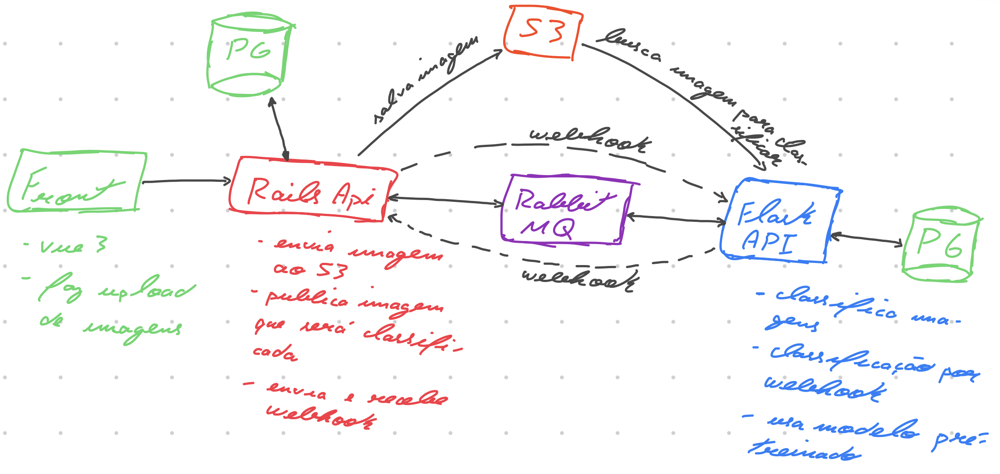

# Reconhecimento de dígitos

TODO replace image by a diagram

## Aplicação (TODO)

### Módulo `classification engine`
Módulo que contém os códigos utilizados durante a investigação e modelagem do modelo de classificação, o modelo pré-treinado está no arquivo `/digits-classification/classification-engine/model_v1.h5`.

#### Modelo de classificação
O modelo utilizado na classificação dos dígitos é um `MLP` com duas camadas ocultas que segue a seguinte arquitetura.

| Camada    | Parâmetros                                                         |
|-----------|--------------------------------------------------------------------|
| Entrada   | input_shape=(28,28)                                                |
| Dense (1) | units=256, activation='relu', kernel_initializer=RandomNormal()    |
| Dense (2) | units=128, activation='sigmoid', kernel_initializer=RandomNormal() |
| Saída     | units=10, activation='softmax'

Os hiperparâmetros utilizados foram:
  - `epochs`: 50;
  - `optimizer`: `rmsprop`;
  - `loss`: categorical_crossentropy;
  - `validation_split`: 0.2.

#### Resultados

| Base      | Acurácia | Perda |
|-----------|----------|-------|
| teste     | 0.979    | 0.124 |
| validação | 0.989    | 0.06  |

## Setup (TODO)
  - `classification engine`:

## Notes:

## TODO:
  - [ ] Add readme classification-engine;
  - [ ] Describe scripts on classification engine module;
  - [ ] Add flask api that loads pre-trained model and return a image class.
